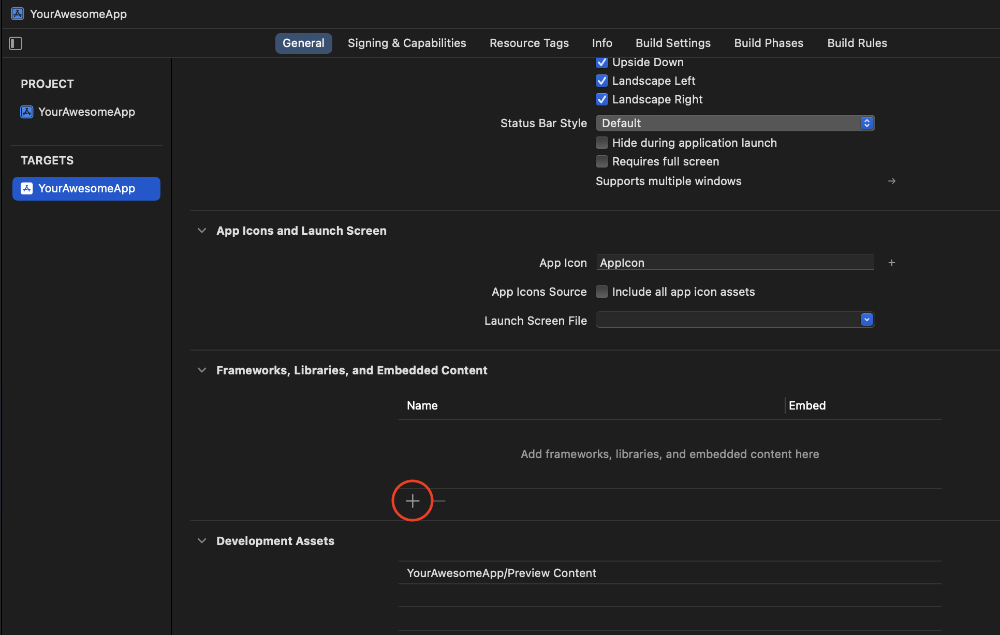
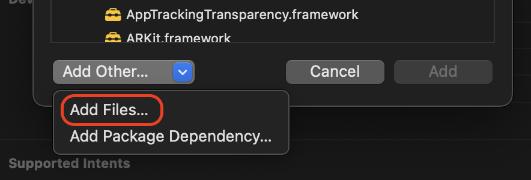

# openssl-ios

Pre-compiled openssl framework for iOS and iPadOS applications! Automatically updated within 24-hours of a new release of openssl.

## Using the pre-compiled framework

1. Download and extract the xcframework.zip from the latest release.
   
   If you are planning on using OpenSSL in Swift, use `openssl_swift.xcframework.zip`, otherwise use `openssl.xcframework.zip`.

1. _(Optional but recommended)_ download the [signing key](signingkey.pem) and the .sig file for your downloaded zip from the release and verify the signature using OpenSSL
    ```bash
    openssl dgst -sha256 -verify signingkey.pem -signature openssl.xcframework.zip.sig openssl.xcframework.zip
    ```

1. Select your target in Xcode and click the "+" under Frameworks, Libraries, and Embedded Content  
    
1. Click "Add Other" then "Add Files..."  
    
1. Select the extracted `openssl.xcframework` directory.

   Note that Xcode will reference the directory _in-place_, so make sure you've moved it somewhere suitable (outside your downloads directory!).

## Compile it yourself

Use the included build script to compile a specific version or customize the configuration options.

```
./build-ios.sh [-o <openssl version>] [-vsg] [-- build args]

Options are:

-o <openssl version>
   Specify the version of openssl package to download and use. If not specified, will query
   the openssl/openssl repo and use the latest release. If not specified then the 'jq'
   utility must be installed.

-v
   Verify signatures of downloaded artifacts

-s
   Include a Swift module map and shim files. Do not use this if you plan to use this framework in
   an Objective-C project.

-g
   Use the 'gh' command line tool instead of curl for GitHub API queries. This is useful for when
   running this script in a Github action.

-- build args
   Any arguments after -- are passed directly to the ./configure step of compiling curl. Regardless
   of this value these parameters are always provided:
   -no-shared -no-ui-console -no-tests -no-legacy -no-ssl2 -no-ssl3 -no-asm -no-weak-ssl-ciphers
```

## Export Compliance

Please remember that export/import and/or use of strong cryptography software, providing
cryptography hooks, or even just communicating technical details about cryptography
software is illegal in some parts of the world. By using this script, or importing the
resulting compiled framework in your country, re-distribute it from there or even just
email technical suggestions or even source patches to the authors or other people you are
strongly advised to pay close attention to any laws or regulations which apply to you.
The authors of this script and OpenSSL are not liable for any violations you make here.
So be careful, it is your responsibility. 
