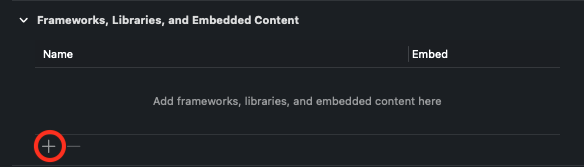
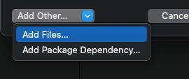

# openssl-ios

Pre-compiled openssl framework for iOS and iPadOS applications! Automatically updated within 24-hours of a new release of openssl.

## Using the pre-compiled framework

1. Download and extract openssl.xcframework.zip from the latest release
1. Compare the SHA-256 checksum of the downloaded framework with the fingerprint in the release
    ```bash
    shasum -a 256 openssl.xcframework.zip
    ```
    1. _Optionally_ download the signing key from this repo and the openssl.xcframework.zip.sig from the release and verify the signature
        ```bash
        openssl dgst -sha256 -verify signingkey.pem -signature openssl.xcframework.zip.sig openssl.xcframework.zip
        ```
1. Select your target in Xcode and click the "+" under Frameworks, Libraries, and Embedded Content  
    
1. Click "Add Other" then "Add Files..."  
    
1. Select the extracted openssl.xcframework directory

## Compile it yourself

Use the included build script to compile a specific version or customize the configuration options

```
./build-ios.sh <openssl version> [optional configure parameters]
```

The following config parameters are always provided: `-no-shared`, `-no-ui-console`, `-no-tests`, `-no-stdio`, `-no-threads`, `-no-legacy`, `-no-ssl2`, `-no-ssl3`, `-no-hw`, `-no-weak-ssl-ciphers`.

## Export Compliance

Please remember that export/import and/or use of strong cryptography software, providing
cryptography hooks, or even just communicating technical details about cryptography
software is illegal in some parts of the world. By using this script, or importing the
resulting compiled framework in your country, re-distribute it from there or even just
email technical suggestions or even source patches to the authors or other people you are
strongly advised to pay close attention to any laws or regulations which apply to you.
The authors of this script and OpenSSL are not liable for any violations you make here.
So be careful, it is your responsibility. 
